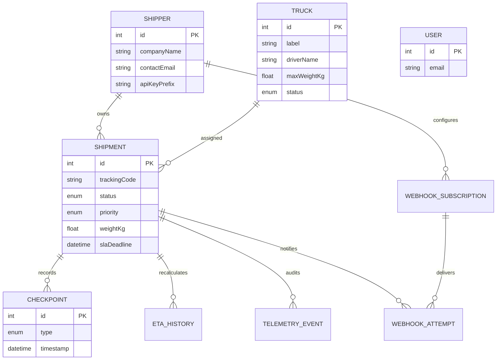
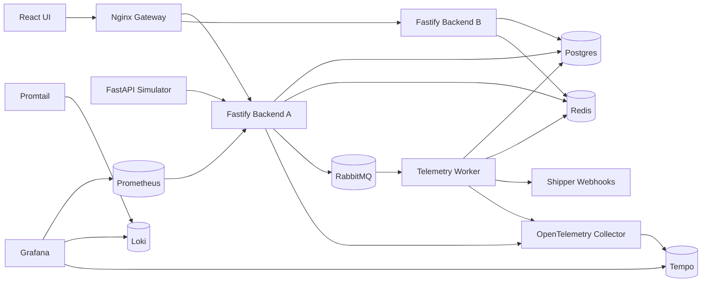

# Transit Grid Logistics Platform Report Source

## 1. Cover Page

Team name, motto, roster, GitHub URL, deployed URL, and final date will be filled before PDF export.

## 2. Abstract

Transit Grid is a distributed shipment-tracking platform for logistics operators and shippers. The system combines a relational operational database with Redis tracking snapshots, RabbitMQ telemetry streaming, WebSocket live tracking, webhook notifications, and an Nginx gateway in front of multiple backend replicas.

## 3. Business Requirements

### Business Scenario

Transit Grid is a logistics brokerage platform for a regional freight company that coordinates shippers, contracted fleet capacity, dispatch operators, and end customers. A broker accepts shipment requests from shippers, creates load records with priority and SLA commitments, and hands each load to the fleet manager for capacity-aware truck assignment. A dispatch operator monitors live telemetry, ETA drift, webhook failures, and delay exceptions. Shippers receive webhook notifications and use a restricted portal to see only their freight. Customers receive a public tracking code and can view shipment status without seeing internal IDs, truck-management controls, webhook configuration, or broker-only data.

Actors:

- Broker: owns shipper relationships, creates loads, sets priority, monitors account health.
- Fleet manager: manages trucks, drivers, capacity, assignment readiness, and proof-of-delivery handoff.
- Dispatch operator: watches telemetry, delay exceptions, webhook retries, ETA changes, and system health.
- Shipper operations user: tracks company shipments, webhook subscriptions, API key status, and SLA risk.
- Customer/recipient: opens a public tracking page by tracking code.
- Simulator/telemetry producer: emits GPS events as an external movement source.

### Use Cases

1. Broker creates a shipper load.
   Primary flow: broker selects a shipper, enters origin/destination, cargo, weight, priority, and deadline; system geocodes locations, plans route, generates a public tracking code, creates a `CREATED` checkpoint, and shows the load on the broker board.

2. Fleet manager assigns a truck.
   Primary flow: fleet manager opens the load, reviews nearest idle compatible trucks, selects a truck whose capacity is greater than shipment weight, system rejects busy or overloaded trucks, marks shipment `ASSIGNED`, creates an `ASSIGNED` checkpoint, and starts simulator movement.

3. Dispatch operator monitors live delivery.
   Primary flow: simulator sends GPS telemetry, backend accepts it through the telemetry endpoint, RabbitMQ queues the event, worker updates truck position, recomputes ETA, writes ETA history, refreshes Redis tracking snapshots, and broadcasts WebSocket updates to dashboards.

4. System detects a delayed shipment.
   Primary flow: worker detects that ETA breaches SLA or the truck has stopped beyond the priority grace period; shipment becomes `DELAYED`, a delay checkpoint is created, ETA history is written, broker and operations dashboards show the exception, and shipper webhook attempts are recorded.

5. Shipper receives webhook notifications.
   Primary flow: shipper configures event subscriptions for assignment, departure, delay, and arrival; system signs webhook payloads, records response status and errors, schedules retries for failures, and exposes delivery attempts to operations.

6. Customer tracks a shipment publicly.
   Primary flow: customer enters a tracking code such as `TRK-2026-DEMO01`; system reads the Redis snapshot or Postgres fallback and returns safe tracking data containing status, ETA, route, truck label, and checkpoints only.

7. Fleet manager records proof of delivery.
   Primary flow: after arrival, fleet manager enters recipient name, note, timestamp, and proof reference URL; system stores proof fields, creates a `DELIVERED` checkpoint, updates shipment status, and emits live tracking/webhook events.

### Functional Requirements

- The system shall manage shippers, shipments, trucks, checkpoints, ETA history, telemetry audit events, webhook subscriptions, webhook attempts, proof of delivery, and users.
- The system shall generate unique public tracking codes and never require customers to know internal database IDs.
- The system shall enforce truck assignment rules: only idle trucks with sufficient capacity can be assigned.
- The system shall recompute ETA from live truck telemetry and store meaningful ETA changes.
- The system shall detect delayed shipments from SLA breach or stopped-truck conditions.
- The system shall support REST APIs for business resources and WebSocket APIs for live tracking.
- The system shall support webhook notifications to shippers with signed payloads and retry records.
- The system shall provide dedicated dashboards for broker, fleet manager, dispatch operations, shipper user, and customer tracking.

### Non-Functional Requirements

- Scale: support at least 1,000 active shipments, 250 trucks, 50 shippers, and 10 telemetry events per second in the project deployment profile.
- Latency: public tracking p95 read latency should be below 150 ms using Redis snapshots; telemetry ingestion should acknowledge within 250 ms; WebSocket updates should normally reach connected clients within 2 seconds after worker processing.
- Availability: API traffic must enter through Nginx and load-balance across two backend replicas; stateful services must use named Docker volumes.
- Security: public tracking must expose only safe shipment fields; shipper API keys and webhook secrets must not be returned after creation/rotation; auth and public tracking endpoints must be rate-limited by the from-scratch token bucket.
- Reliability: telemetry processing must be asynchronous through RabbitMQ; webhook attempts must preserve status, retry count, errors, and next retry time.
- Observability: backend, worker, and infrastructure must expose metrics/logs/traces to the unified Grafana/Prometheus/Loki/Tempo stack.
- Documentation: Swagger UI must document REST endpoints, and the report must include ER, architecture, Docker dependency, gateway traffic, and BPMN workflow diagrams.

## 4. Domain Model And ER Diagram

## 5. System Architecture

## 6. API Design

Core REST resources:

- `/auth/register`, `/auth/login`
- `/shipments`, `/shipments/:id`, `/shipments/:id/assign-truck`, `/shipments/:id/truck-suggestions`, `/shipments/:id/proof-of-delivery`
- `/tracking/:id`, `/tracking/code/:trackingCode`
- `/trucks`
- `/shippers`, `/shippers/:id/api-key/rotate`
- `/webhook-subscriptions`, `/webhook-attempts`, `/webhook-attempts/:id/retry`
- `/analytics/overview`, `/analytics/eta-history`

Non-REST protocol:

- `WS /ws/tracking?shipmentId=...`
- `WS /ws/tracking?trackingCode=...`

Events: `snapshot`, `location.updated`, `shipment.status.changed`, `shipment.delayed`, `shipment.arrived`, `error`.

## 7. Data-Layer Design

Postgres stores normalized operational state: shippers, trucks, shipments, checkpoints, ETA history, webhook subscriptions, webhook attempts, and telemetry audit rows. Redis stores active tracking snapshots and pub/sub events because hot public tracking reads are key-value lookups with short-lived freshness requirements. RabbitMQ decouples telemetry ingestion from shipment state mutation.

Indexes are defined for tracking code lookup, shipper shipment lists, status/priority filtering, checkpoint timelines, ETA history, webhook retry scans, and active truck assignment.

## 8. Pipeline

Telemetry workflow is documented in `report/bpmn/telemetry-workflow.bpmn`.

## 9. From-Scratch Component

The token bucket in `server/src/system-components/token-bucket.js` implements refill and consume logic from scratch. It is integrated through the Fastify rate-limit plugin and applied to auth, public tracking, and WebSocket subscriptions.

## 10. Infrastructure And Deployment

Docker Compose starts all services and exposes only Nginx on port `8080`. Nginx routes `/api/*`, `/docs`, `/ws/*`, and frontend traffic, and balances requests across `backend-a` and `backend-b`.

## 11. Observability

Prometheus scrapes backend metrics, Promtail sends Docker logs to Loki, Tempo receives traces through the OpenTelemetry collector, and Grafana provisions Prometheus, Loki, and Tempo datasources plus a logistics overview dashboard.

## 12. Testing And Known Limitations

Known limitations:

- Proof-of-delivery media is represented as an external URL/reference.
- Webhook signing stores a hash for demonstration; production should use a secrets manager or encryption.
- Benchmarks must be captured after deployment for final report numbers.

## 13. Team Contribution Table

Fill with member names, IDs, roles, feature ownership, and commit ratios before submission.

## 14. References

- Martin Kleppmann, Designing Data-Intensive Applications.
- Fastify, Prisma, Docker, RabbitMQ, Redis, Grafana, OpenTelemetry, and Nginx official documentation.
